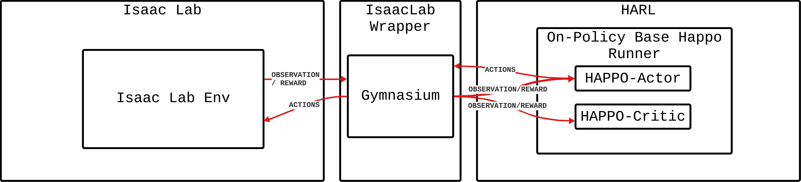
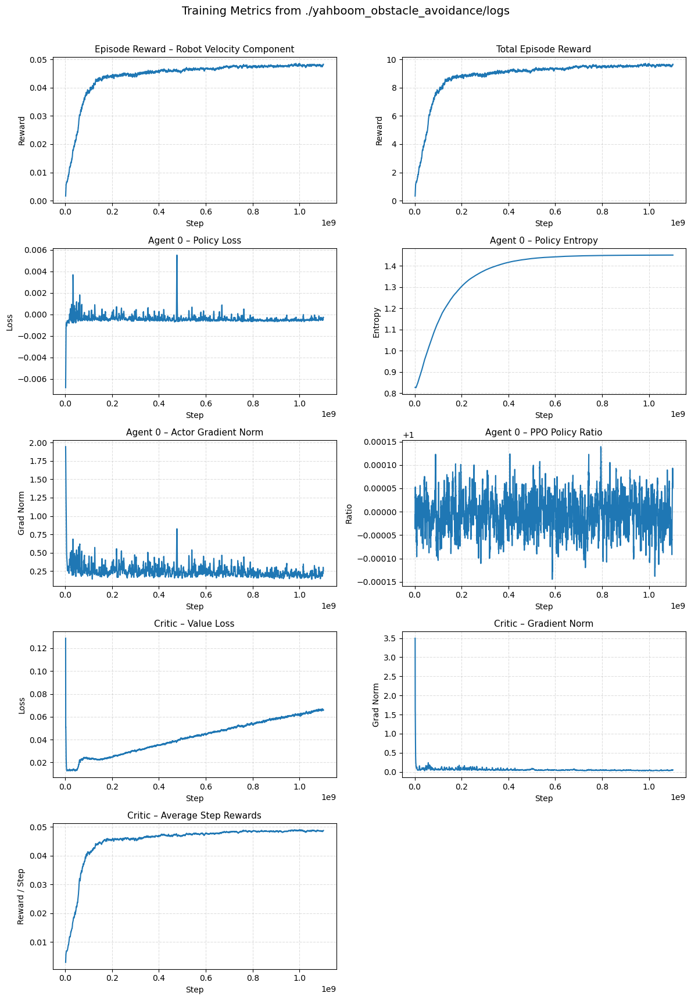

# Yahboom Obstacle Avoidance Task
This README can also be viewed online at https://github.com/Isaacwilliam4/IsaacLab-Final_Project/tree/main/source/isaaclab_tasks/isaaclab_tasks/direct/yahboom.

This README is part of the repository IsaacLab-Final_Project and is found at
`IsaacLab-Final_Project/source/isaaclab_tasks/isaaclab_tasks/direct/yahboom`  
and contains the Yahboom obstacle avoidance task built on NVIDIA Isaac Lab.

The instructions below will help you set up the Conda environment, install dependencies (including Isaac Sim), and run the preconfigured VS Code task.

---

## 1. Clone the Repository

```bash
git clone https://github.com/Isaacwilliam4/IsaacLab-Final_Project.git
cd IsaacLab-Final_Project
````

---

## 2. Create the Conda Environment

Use the provided helper script to create the Conda environment:

```bash
./isaaclab.sh -c isaaclab_final_project
```

This will create a Conda environment named `isaaclab_final_project`.

---

## 3. Activate the Environment and Install Dependencies

Activate the environment:

```bash
conda activate isaaclab_final_project
```

Then install the project dependencies:

```bash
./isaaclab.sh -i
```

---

## 4. Install Isaac Sim into the Environment

Install Isaac Sim (5.1.0) into the active Conda environment:

```bash
pip install "isaacsim[all,extscache]==5.1.0" --extra-index-url https://pypi.nvidia.com
```

> **Note:** Make sure `pip` is the one from the `isaaclab_final_project` environment (it will be if the Conda env is activated).

---

## 5. Configure VS Code to Use the Environment

If you are using VS Code, select the `isaaclab_final_project` environment as the Python interpreter:

1. Press `Ctrl + Shift + P`
2. Search for **“Python: Select Interpreter”**
3. Choose the interpreter corresponding to `isaaclab_final_project`

---

## 6. Run the Yahboom Task from VS Code

A VS Code task is provided to run the Yahboom obstacle avoidance scenario.

1. Press `Ctrl + Shift + P`
2. Search for **“Run Task”**
3. Select **`play yahboom final velocity`**

If the environment and dependencies are set up correctly, the task should launch and run without additional configuration.


# Analysis for Final Project

## Environment Setup / Training Procedure




For training we utilized HAPPO with a single agent (which is just PPO), but it allows the flexibility for the addition of multiple agents later on if needed. 

## Reward Function

As observation the robot recieves a reduced size 40x40 depth camera.

The reward function is defined in `yahboom_high_velocity.py` on line 240.

```python
def _get_rewards(self) -> dict:
    robot_vel = torch.abs(self.robots["robot_0"].data.root_lin_vel_b[:,0]) * self.step_dt
    robot_vel = torch.nan_to_num(robot_vel, nan=0.0, posinf=1e6, neginf=-1e6)

    self._episode_sums["robot_vel_reward"] += robot_vel
    return {"robot_0": robot_vel}
```

It is simply the relative velocity of the robot in the X direction. So that it gets more reward for going faster, this encourages the robot to avoid obstacles. 

## Key Diagnostics


As can be seen in the results, the model succesfully learned to maximise reward until convergence. The video demonstrates more qualitative results of the robot. Some interesting insights from these metrics include the extremely small policy ratio. This means that our agent was making very small updates to the policy over time, which mean that we could have potentially increase the clipping parameter or the learning rate of the model and potentially seen faster convergence. The other interesting note is the gradually increasing value loss as the reward reaches convergence. The value loss is representative of how well the critic can understand the discounted future rewards, and it's hard to understand why that would be the case as the reward converges. One hypotheses (and a reason sometimes the robot just crashes into blocks), is that there is a bug in the physics simulation that if the robot manages to crash into a block at a certain angle, he gets launched, hence increasing its reward. But this bug is somewhat random, and so if the agent is increasing its reward by trying to exploit this bug, the critic will have a harder and harder time predicting this random process.

## Video

[](https://youtu.be/tQhDa2wzx7I)

In the video you can see the robot observation (left) and it successfully traversing the environment while avoiding obstacles (right). 

## Parameter Rationale

First, I use the HAPPO training environment as recent research required its integration with Isaaclab, allowing for easier development and iteration. The motivation of the project was to demonstrate that reinforcement learning could be used to successfully navigate through the environment while avoiding obstacles with a simple depth camera. Since these models are relatively small (~900kb), they can be run in real time on a cpu and severely reduce the amount of computation necessary for environment navigation for a robot. Typically, fairly computationally expensive software navigation stacks are implemented (like SLAM), that often are too computationally intensive to run on simple robots. This was actually a struggle we ran into when trying to do local navigation on a yahboom r2 robot, and we were able to run this simple rl model without issue on the robot (we did run into issues with glossy floors messing with the depth camera). 

With regard to parameter choices, the HAPPO framework comes with default parameters that have been shown to work in previous training iterations, though understanding if there are better hyperparameter choices for high-fidelity physics training could be interesting future research. 

The reward was chosen, because in my experience, the simpler the reward, the easier to debug and evaluate the performance of the training. I did mess around with different rewards (global velocity instead of relative), but found that simply rewarding velocity along the relative forward and reverse axis performed best.

Obviously high velocity doesn't make sense in a practical context, but this served as more of a baseline to show that the model could learn rudimentary obstacle avoidance with a very simple observation space. Future research will explore more practical scenarios like a go-to-goal policy. 